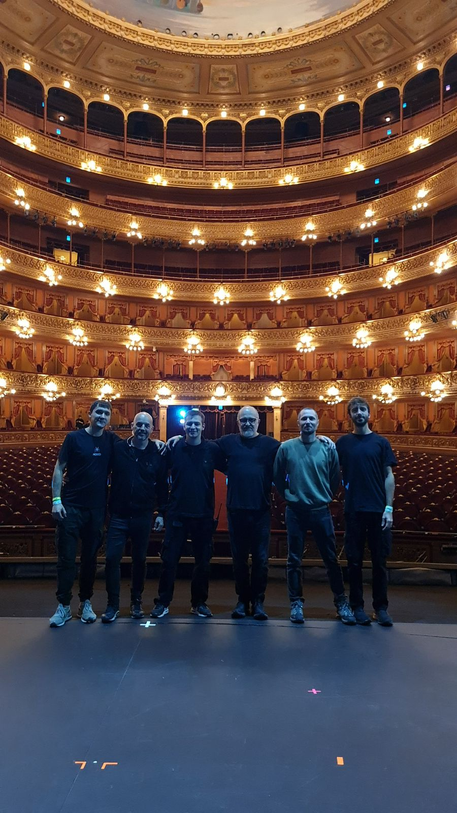
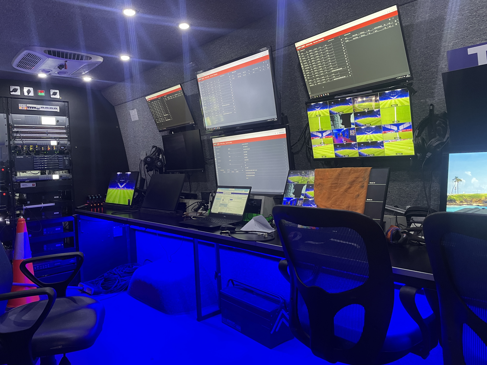
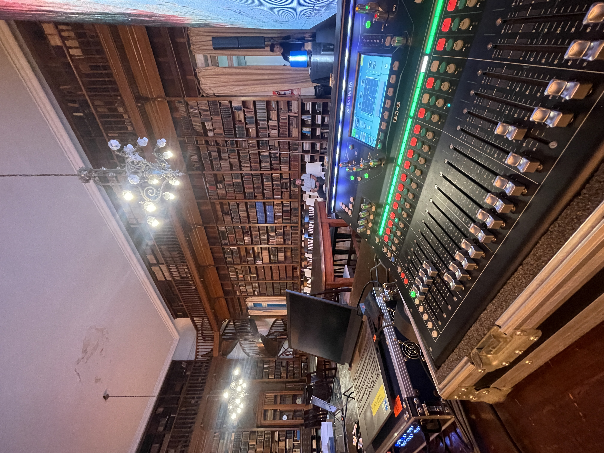
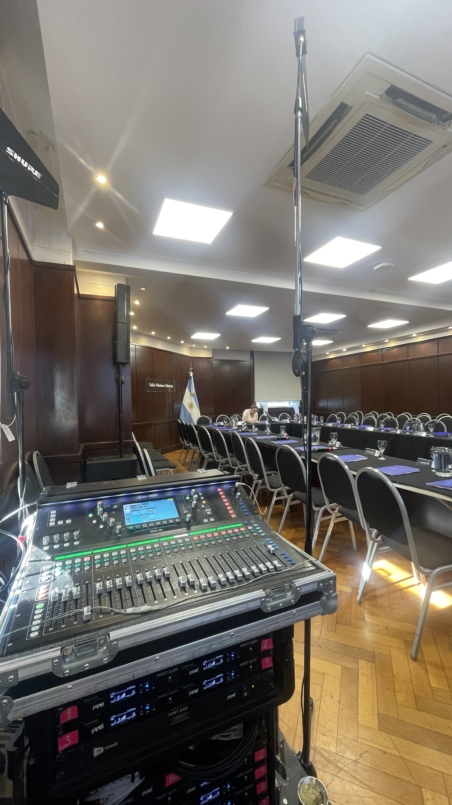
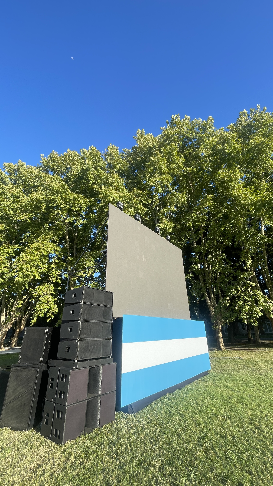

### Hi there, I'm Pedro Venezia 👋

I am a **Sound Engineering student** at **Universidad Nacional de Tres de Febrero (UNTREF)** with a strong focus on electroacoustics and live sound reinforcement. My work combines technical rigor with a pragmatic approach to ensure high-quality auditory experiences in high-pressure environments.

#### 🔭 Current Focus & Research
* **Thesis:** Investigating the **perception of temporal response in subwoofer arrays**. My research analyzes the psychoacoustic trade-off between **directivity control** for consistent coverage and the preservation of **transient fidelity** due to impulse response stretching.
* **Academic:** 90% of the Sound Engineering degree completed with an average of 8.4/10.
* **Interests:** Acoustic prediction for large-scale events, design and maintenance of electroacoustic equipment, and architectural acoustics for professional studios.

#### 🎛️ Professional Experience: Live Sound & Systems
I specialize in the design, adjustment, and operation of sound reinforcement systems:
* **System Engineering:** PA adjustment (Line Arrays), front fills, and delays; time alignment of distributed systems; and directivity control.
* **Live Operations:** RF coordination, digital protocols (MADI/Dante), and multi-track recording.
* **Current Roles:**
    * **System Tech** for the award-winning musical *"Cuando Frank Conoció a Carlitos"* at Teatros Astral & Tabarís.
    * **Sound Technician** at **Mosqui Sonido Profesional**, handling major venues like the Vélez Sarsfield Stadium and Teatro Colón.

#### 🎓 Teaching & Leadership
I have a strong vocation for teaching and collaborating in multidisciplinary teams as a **Teaching Assistant at UNTREF (2019–Present)** in:
* *Acoustics & Psychoacoustics I*
* *Electroacoustics I & II*
* *Electricity & Magnetism*
* *Physics I*

#### 🛠️ Tech Stack
* **Acoustics/Simulation:** Smaart, REW, EASE, Ease Focus, AutoCAD, SketchUp.
* **Programming & Tools:** Python 3 (Signal processing & data visualization), LaTeX, and Excel.
* **Audio:** Digital consoles (DiGiCo, RME) and various DAWs (Reaper, etc.).

#### 📫 Connect with me
* **LinkedIn:** [linkedin.com/in/pedro-venezia](https://linkedin.com/in/pedro-venezia)
* **Email:** [pedro_venezia@icloud.com](mailto:pedro_venezia@icloud.com)

## 📋 Resume & CV

You can download my full resume here:

## 🎥 Know Me!

  

## 📸 My Work
## 📸 My Work

  
  
  

   
    
  

   
  
  

   
  
   
 

   
  
  

   
  
  
  

## 📚 Academic Presentations

Coursework and presentations from my engineering degree:

### Acoustics Laboratory
- 📄 [Influence of the musical excerpt envelope on the relative modal threshold](./LA2024-2_Venezia_Influence-of-the-musical-excerpt-envelope-on-the-relative-modal-threshold.pdf)
- You can take the Listening Test in the following [Link](https://abxtests.com/?st=gicvvigl&dl=0&test=https%3A%2F%2Fwww.dropbox.com%2Fscl%2Ffi%2Fm4oavrkrvkek9afq7v81x%2FABX_modal_V1.yaml%3Frlkey%3Dztglb1jfb966pz9q73rq4tzwk) 

## 🎬 Inspiring & Useful Resources

