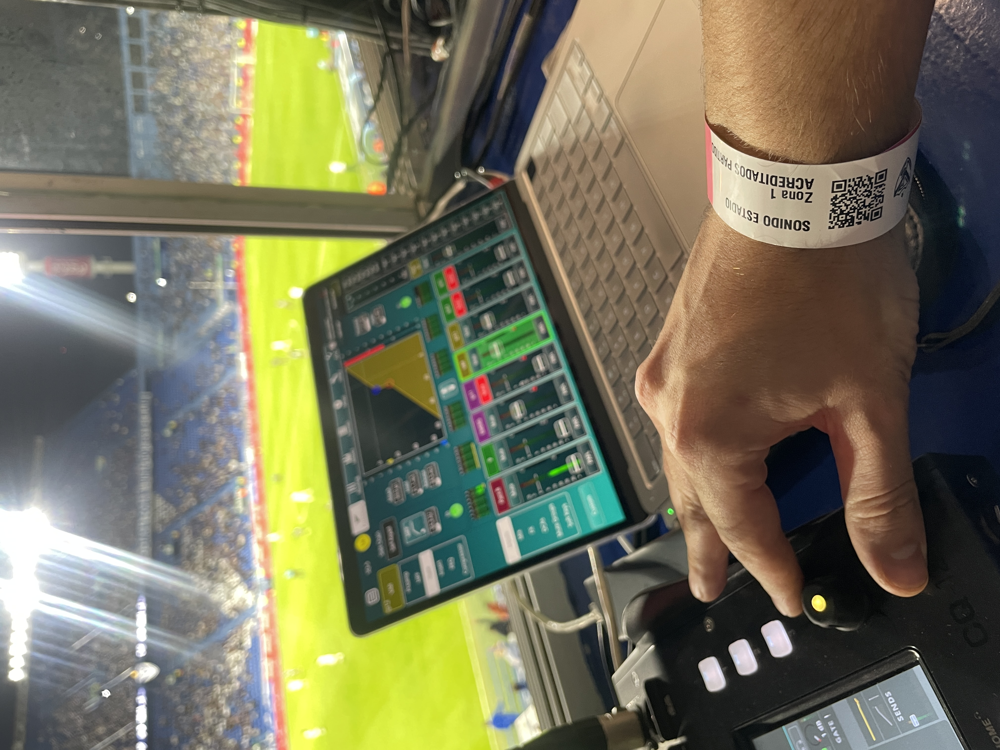
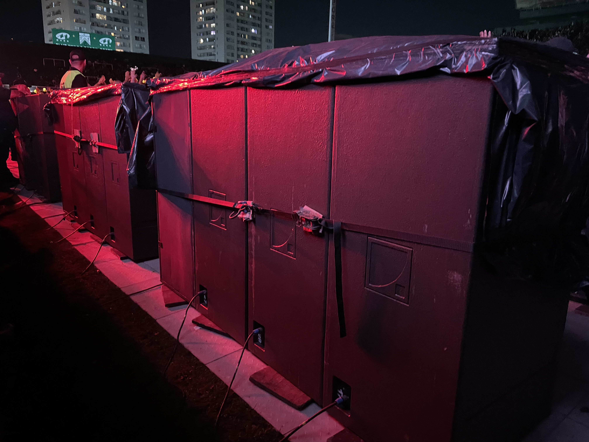

### Hi there, I'm Pedro Venezia 👋

I am a **Sound Engineering student** at **Universidad Nacional de Tres de Febrero (UNTREF)** with a strong focus on electroacoustics and live sound reinforcement. My work combines technical rigor with a pragmatic approach to ensure high-quality auditory experiences in high-pressure environments.

#### 🔭 Current Focus & Research
* **Thesis:** Investigating the **perception of temporal response in subwoofer arrays**. My research analyzes the psychoacoustic trade-off between **directivity control** for consistent coverage and the preservation of **transient fidelity** due to impulse response stretching.
* **Academic:** 90% of the Sound Engineering degree completed with an average of 8.4/10.
* **Interests:** Acoustic prediction for large-scale events, design and maintenance of electroacoustic equipment, and architectural acoustics for professional studios.

#### 🎛️ Professional Experience: Live Sound & Systems
I specialize in the design, adjustment, and operation of sound reinforcement systems:
* **System Engineering:** PA adjustment (Line Arrays), front fills, and delays; time alignment of distributed systems; and directivity control.
* **Live Operations:** RF coordination, digital protocols (MADI/Dante), and multi-track recording.
* **Current Roles:**
    * **System Tech** for the award-winning musical *"Cuando Frank Conoció a Carlitos"* at Teatros Astral & Tabarís.
    * **Sound Technician** at **Mosqui Sonido Profesional**, handling major venues like the Vélez Sarsfield Stadium and Teatro Colón.

#### 🎓 Teaching & Leadership
I have a strong vocation for teaching and collaborating in multidisciplinary teams as a **Teaching Assistant at UNTREF (2019–Present)** in:
* *Acoustics & Psychoacoustics I*
* *Electroacoustics I & II*
* *Electricity & Magnetism*
* *Physics I*

#### 🛠️ Tech Stack
* **Acoustics/Simulation:** Smaart, REW, EASE, Ease Focus, AutoCAD, SketchUp.
* **Programming & Tools:** Python 3 (Signal processing & data visualization), LaTeX, and Excel.
* **Audio:** Digital consoles (DiGiCo, RME) and various DAWs (Reaper, etc.).

#### 📫 Connect with me
* **LinkedIn:** [linkedin.com/in/pedro-venezia](https://linkedin.com/in/pedro-venezia)
* **Email:** [pedro_venezia@icloud.com](mailto:pedro_venezia@icloud.com)

## 📋 Resume & CV

You can download my full resume here:

## 🎥 Know Me!

  

## 📸 My Work

  
  
  

  
  
  

  
  
  

  
  
  

  
  
   
  

  
  

  
  

## 📚 Academic Presentations

Coursework and presentations from my engineering degree:

### Acoustics Laboratory
- 📄 [Influence of the musical excerpt envelope on the relative modal threshold](./LA2024-2_Venezia_Influence-of-the-musical-excerpt-envelope-on-the-relative-modal-threshold.pdf)
- You can take the Listening Test in the following [Link](https://abxtests.com/?st=gicvvigl&dl=0&test=https%3A%2F%2Fwww.dropbox.com%2Fscl%2Ffi%2Fm4oavrkrvkek9afq7v81x%2FABX_modal_V1.yaml%3Frlkey%3Dztglb1jfb966pz9q73rq4tzwk) 

### Acoustics & Psicoacustics I 
-

## 🎬 Inspiring & Useful 

### 🎓 Academic & Technical Resources
- [Acoustics & Psicoacoustics UNTREF (Petrosino)](https://acustica1untref.blogspot.com/)
- [Acoustics & Psicoacoustics UNTREF](https://sites.google.com/untref.edu.ar/ayp1untref/home?authuser=0)
- [ESP Sound Projects (Rod Elliott)](https://sound-au.com/)
- [Linkwitz Lab (Siegfried Linkwitz)](https://www.linkwitzlab.com/index.htm)
- [Leach Legacy (Marshall Leach)](https://leachlegacy.ece.gatech.edu/)
- [Dan Russell – Acoustics Demos](https://www.acs.psu.edu/drussell/demos.html)
- [Douglas Self – Audio Design](http://www.douglas-self.com/)

---

### 🎓 Online Courses & Certifications
- [Computers, Waves, Simulations (Coursera)](https://www.coursera.org/learn/computers-waves-simulations)  
  *Numerical methods for wave phenomena, simulation, and physical modeling.*

- [Dante Certification Program (Audinate)](https://www.getdante.com/resources/training/dante-certification-program/)  
  *Industry-standard certification for Audio over IP (AoIP), covering networking, system design, and real-world AV deployment.*
  
---

### 🧠 Interactive Simulations & Learning
- [Falstad Circuit & Physics Simulators](http://falstad.com/)
- [Walter Fendt – Physics Simulations](https://www.walter-fendt.de/)
- [Wave Simulation (OSP)](https://www.compadre.org/osp/EJSS/4466/252.htm?F=1)
- [Resonance Simulation](https://www.walter-fendt.de/html5/phes/resonance_es.htm)
- [Wave Interference](https://www.compadre.org/osp/EJSS/4416/211.htm)
- [Ciechanow – Interactive Sound Visualization](https://ciechanow.ski/sound/)

---

### 📺 YouTube Channels
- [3Blue1Brown (Mathematics & Visualization)](https://youtube.com/@3blue1brown)
- [Jorge Petrosino (Acústica, Electrónica, Ciencias de la Educación)](https://www.youtube.com/@JorgePetrosino)
- [Dan Russell (Acoustics)](https://youtube.com/@danrussellpsu)
- [José Martí Faus (Line Array Systems)](https://youtube.com/@josemartifauslinearray)
- [Audio University (Audio Fundamentals)](https://youtube.com/@audiouniversity)
---

### 🎥 Featured Videos

  
  
  

  
  
  

  
  
  

  
  
  

### 📚 Playlists
- [Walter Lewin – Classical Mechanics (MIT Physics 1.01)](https://www.youtube.com/watch?v=wWnfJ0-xXRE&list=PLyQSN7X0ro203puVhQsmCj9qhlFQ-As8e)  
  *Fundamental course on Newtonian mechanics and physical intuition.*

- [Walter Lewin – Electromagnetism (MIT Physics 8.02)](https://www.youtube.com/watch?v=rtlJoXxlSFE&list=PLyQSN7X0ro2314mKyUiOILaOC2hk6Pc3j)  
  *Core concepts of electric and magnetic fields applied to real systems.*

